# İstanbul Trafik Analizi

*Ağ Programlama* dersi kapsamında geliştirilen bu proje, İstanbul’daki **trafik ve şehir içi mekân verilerini** harita üzerinde görselleştirir. Amaç; kullanıcıların benzin istasyonları, AVM’ler, hastaneler, eczaneler, oteller ve restoranlar gibi noktaları hızlıca keşfetmesi, **yakınındaki yerleri** bulması ve **yoğunluk/rota** bilgileriyle karar vermesini kolaylaştırmaktır.

## 🎯 Neyi Vadediyor?
- **Anlaşılır görselleştirme:** İstanbul’daki önemli nokta türlerini (Eczane, Benzin, Otel, Restoran, Hastane, AVM) tek harita üzerinde, ikonlarıyla birlikte sunar.
- **Konum tabanlı keşif:** Kullanıcı konumuna göre **en yakın yerleri** ve **mesafe bilgisini** gösterir.
- **Filtreleme ve seçim:** Bir veya birden çok mekân türünü seçip belirli sayıda sonuç (5, 10 vb.) listeleyebilirsin.
- **Analiz görünümü:** Otel/restoran listeleri ve puanlarıyla **en iyi seçenekleri** öne çıkarır.
- **Genişletilebilir mimari:** Trafik yoğunluğu/alternatif rota ve makine öğrenimi tabanlı analizler eklenerek kapsam büyütülecektir.

> Harita altyapısı **Leaflet** ve **OpenStreetMap** katkıcılarını kullanır.

## ✨ Ana Özellikler
- 📍 Konum seçme ve koordinat görüntüleme  
- 🧮 “Mekân sayısı” ile sonuç sayısını belirleme  
- 🧭 Seçili mekânların haritada **mesafe** bilgisiyle gösterimi  
- 🧰 Çoklu filtre (eczane, benzin, otel, restoran, hastane, AVM)  
- ⭐ Otel/restoran için puan bazlı “en iyi” listeleri (analiz sayfası)  
- 🗺️ Kullanıcı dostu arayüz (Ana sayfa, Harita, Analiz, Hakkında)

## 🤖 Yapay Zeka Analiz Modülü (Flask)

Bu projede, **Google Cloud / Places API** üzerinden çekilen **otel ve restoran** verileri,
**Flask** tabanlı bir servis ile işlenerek aşağıdaki analizler üretilir:

- **Duygu Analizi (Sentiment):** Google yorumlarından genel memnuniyet puanı.
- **Boyut Bazlı Analiz (Aspect-Based):** *Temizlik, Fiyat, Lezzet, Servis, Konfor* gibi başlıklarda ayrı ayrı skorlar.
- **Sıralama & Öneri:** Seçilen metriklere göre “**En iyi Oteller / Restoranlar**” listeleri.
- **Özetleme:** Yorumlardan kısa içgörü/özet metinleri (opsiyonel).

> Not: Metin işleme tarafında Türkçe için durak kelimeler, kök bulma/lemmazizasyon, emojiler/sayısal temizleme gibi adımlar uygulanır. Model, projeye göre **TF-IDF + Lojistik Regresyon** ya da **BERT-tabanlı** bir Türkçe duygu modeli olarak yapılandırılabilir.

### Mimarinin Kısa Akışı
1. **Veri Toplama:** Google Places API ile yer, puan, yorum ve temel meta veriler alınır.
2. **Önişleme:** Yorumlar temizlenir, dil/karakter normalizasyonu yapılır.
3. **Modelleme:** Yorumlar için sentiment ve/veya aspect skorları üretilir.
4. **Skorlama & Sıralama:** Mekânlar metriklere göre puanlanır ve sıralanır.
5. **Sunum:** Flask API sonuçlarını frontend (harita/analiz sayfası) tüketir.
## 🖼️ Ekran Görüntüleri

**Ana Akış**
| Ana Sayfa (Hero) | Tip Seçim Modali | En Yakın Mekanlar |
|---|---|---|
| 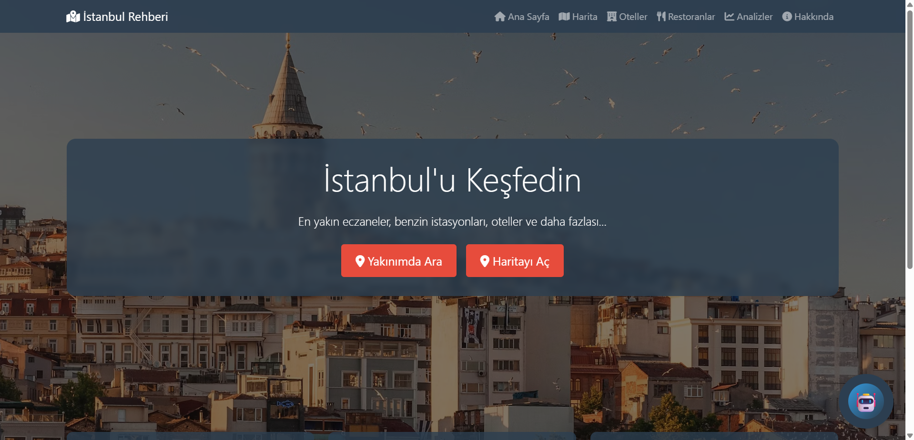 |  |  |

| Eczaneler | Benzin İstasyonları | AVM’ler |
|---|---|---|
| 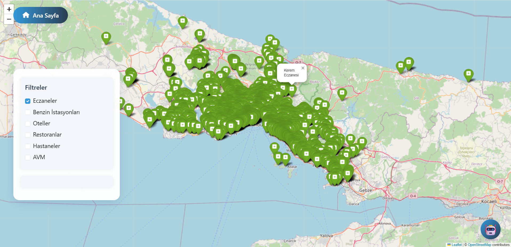 | 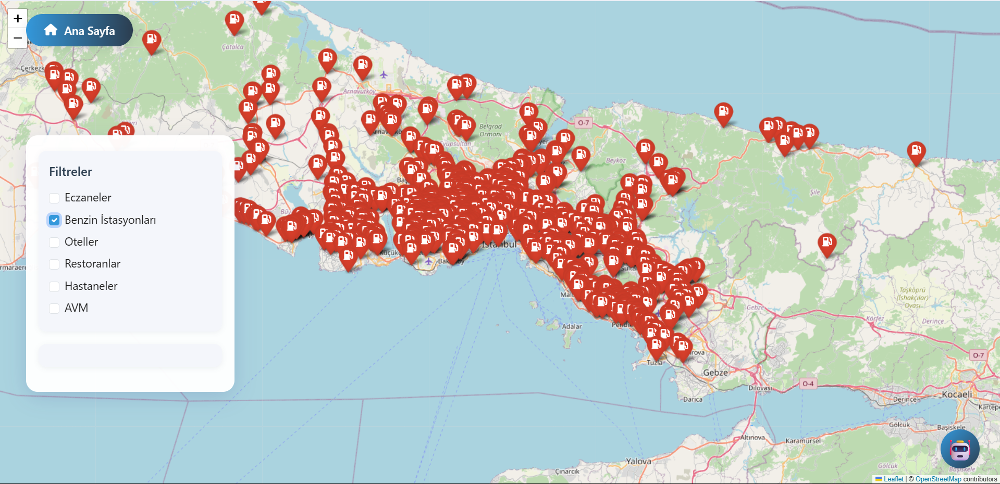 | 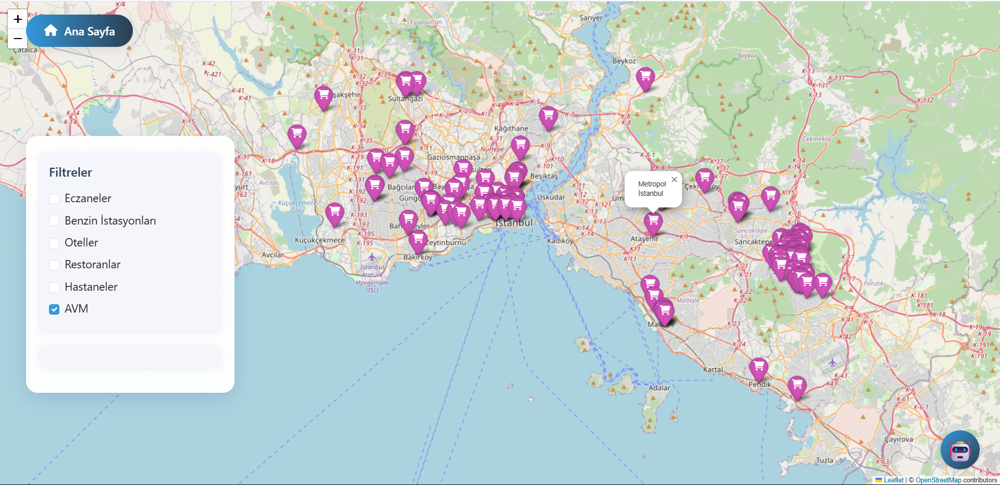 |

**Diğer Katmanlar**
| Oteller (Harita) | Hastaneler (Harita) |  |
|---|---|---|
| 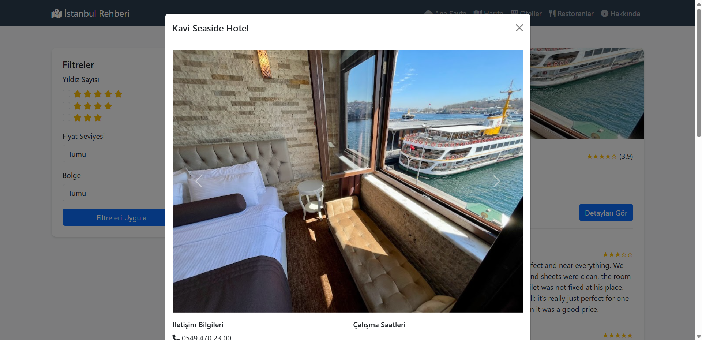 | 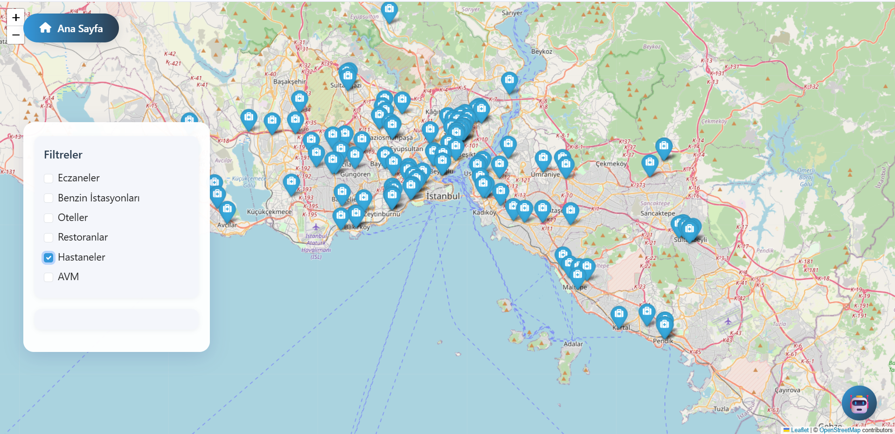 |  |

**Liste/Detay Ekranları**
| En İyi Oteller | En İyi Restoranlar | Otel Detay Modalı |
|---|---|---|
| 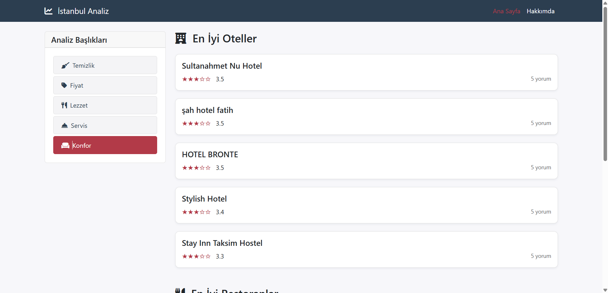 | 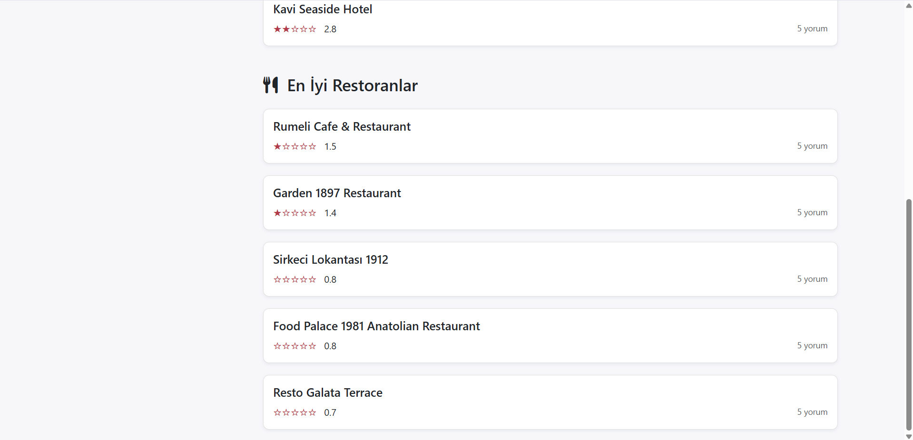 | 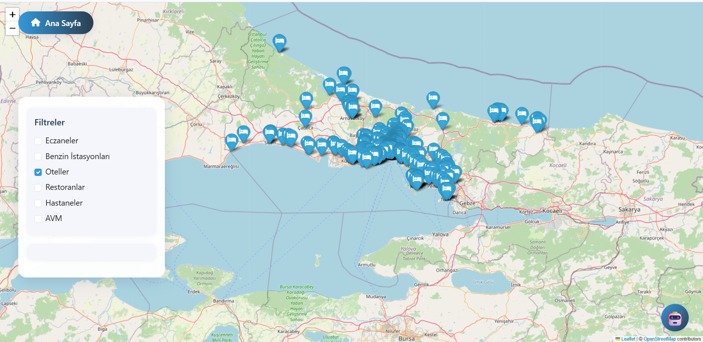 |

**Ek**
| Otel Yorum/Galeri | Hakkında |
|---|---|
| 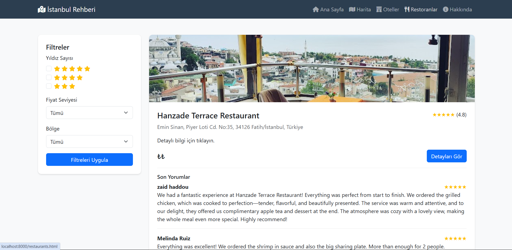 | 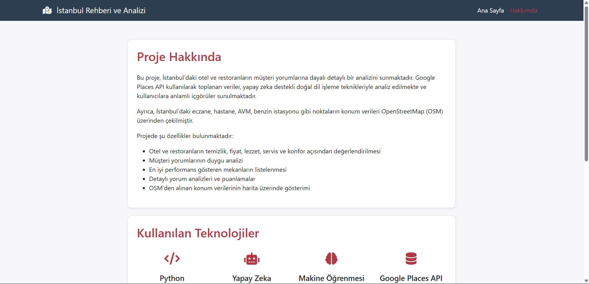 |

## 🗺️ Veri ve Harita
- Harita: **Leaflet** + **OpenStreetMap** (© OSM contributors)  
- Nokta ikonları: tür bazlı özelleştirilmiş marker’lar  
- (Opsiyonel) Dış veri kaynakları ve lisans bilgileri bu bölümde listelenir.

---

